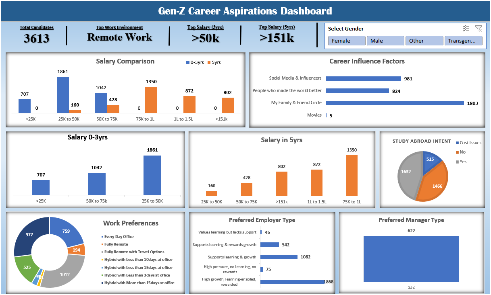
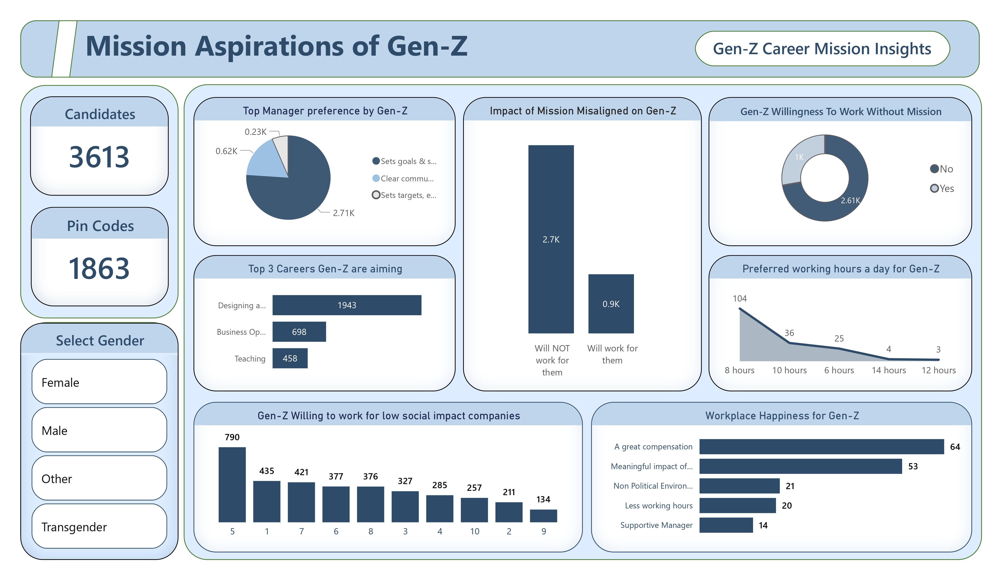
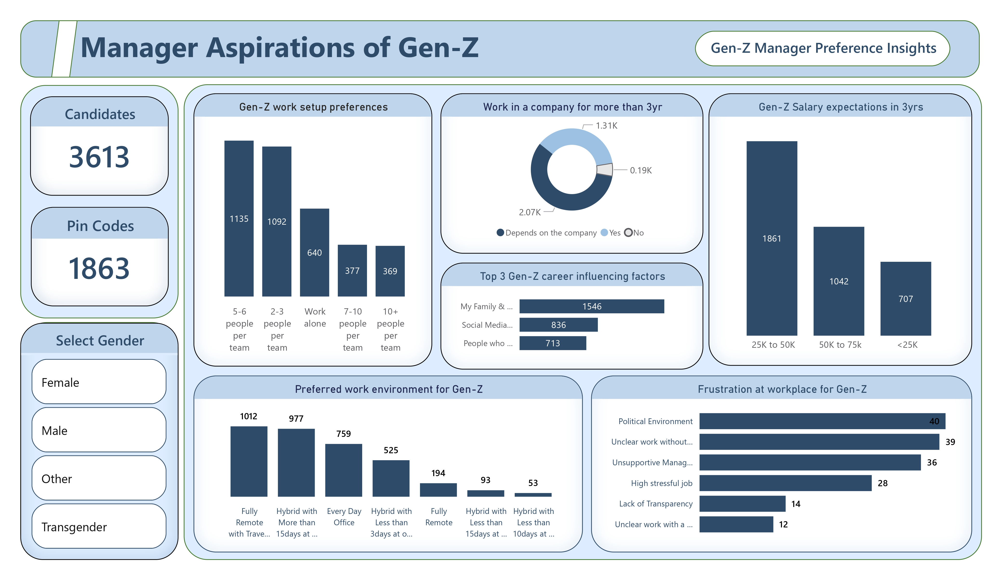

# Gen-Z Career Aspirations Analysis

## Project Overview
This project is an end-to-end Data Analytics case study focused on understanding the career aspirations, workplace expectations, and motivational factors influencing Gen-Z individuals.

Using survey data collected through Google Forms, the project explores how Gen-Z perceives careers, salary growth, work environments, leadership styles, and organizational culture.

The analysis was performed using Excel, SQL, and Power BI to transform raw survey responses into meaningful business insights and interactive dashboards.

---

## Problem Statement
Organizations today face challenges in attracting and retaining Gen-Z talent due to rapidly changing workplace expectations and career priorities.

This project aims to analyze:
- Career interests of Gen-Z
- Preferred work environments
- Salary expectations
- Leadership preferences
- Workplace frustrations
- Impact of social values on career choices

The goal is to help organizations better understand and align with the expectations of the emerging workforce generation.

---

## Objectives
- Collect and analyze Gen-Z career aspiration data
- Identify major career trends and workplace preferences
- Perform data cleaning and transformation
- Conduct exploratory data analysis (EDA)
- Solve business questions using SQL
- Build executive dashboards in Excel and Power BI
- Generate actionable insights and recommendations

---

# Tools & Technologies Used

| Tool | Purpose |
|------|----------|
| Microsoft Excel | Data Cleaning, EDA, Dashboarding |
| SQL | Data Analysis & Querying |
| Power BI | Interactive Dashboard Visualization |
| Power Query | Data Transformation |
| Google Forms | Survey Data Collection |

---

# Project Workflow

## 1. Problem Understanding
Defined business objectives and identified key factors affecting Gen-Z career decisions.

## 2. Data Collection
Collected survey responses using Google Forms covering:
- Career goals
- Salary expectations
- Preferred work environments
- Workplace frustrations
- Leadership expectations

## 3. Data Cleaning & Standardization
Performed:
- Missing value handling
- Column standardization
- Data formatting
- Splitting multi-value responses
- Data transformation using Power Query

## 4. Exploratory Data Analysis (EDA)
Analyzed trends using:
- Pivot Tables
- Charts
- Comparative analysis
- Salary trend analysis
- Work preference analysis

## 5. SQL Analysis
Solved key business questions using SQL queries involving:
- GROUP BY
- ORDER BY
- Aggregate Functions
- UNION ALL
- Data aggregation techniques

## 6. Dashboard Development
Built:
- Executive Excel Dashboard
- Interactive Power BI Dashboards

The dashboards provide insights into:
- Mission aspirations
- Manager expectations
- Salary preferences
- Work culture preferences
- Workplace frustrations

---

# Dashboard Preview

## Excel Executive Dashboard




## Power BI Dashboard – Mission Aspirations




## Power BI Dashboard – Manager Aspirations



---

# Key Insights

## Career Aspirations
- Gen-Z shows strong interest in business, technology, and creative careers.
- Entrepreneurship and freelancing are emerging career preferences.

## Work Environment
- Hybrid and remote work environments are highly preferred over traditional office setups.

## Salary Expectations
- High salary growth expectations strongly influence career decisions.

## Workplace Values
- Meaningful work and social impact matter, but compensation and growth opportunities remain top priorities.

## Leadership Expectations
- Gen-Z prefers managers who:
  - Communicate clearly
  - Set realistic goals
  - Provide mentorship and support

## Workplace Frustrations
Major frustrations include:
- Toxic work culture
- Poor communication
- Unclear responsibilities
- Unsupportive management

---

# Recommendations

Based on the analysis, organizations should:

- Build transparent workplace cultures
- Offer flexible work options
- Improve leadership communication
- Align company mission with employee values
- Create structured growth opportunities
- Reduce unnecessary hierarchy
- Encourage mentorship-driven management

---

# Key Business Questions

1. What industries are Gen-Z most interested in pursuing careers in?
2. What factors influence Gen-Z career choices?
3. What work environment does Gen-Z prefer?
4. How do salary expectations impact career aspirations?
5. What role does social impact play in career decisions?
6. What leadership qualities does Gen-Z expect from managers?
7. What workplace issues frustrate Gen-Z employees the most?

---

# Repository Structure

```text
GenZ-Career-Aspirations/
│
├── README.md
├── datasets/
│   └── raw_data.xlsx
│
├── excel/
│   ├── cleaned_data.xlsx
│   ├── executive_dashboard.xlsx
│   └── eda.xlsx
│
├── sql/
│   └── queries.sql
│
├── powerbi/
│   └── dashboard.pbix
│
├── images/
│   ├── excel_dashboard.png
│   ├── powerbi_dashboard1.png
│   └── powerbi_dashboard2.png
│
└── presentation/
    └── Gen-Z Career Aspirations.pdf
```

---

# Skills Demonstrated

- Data Cleaning
- Exploratory Data Analysis
- SQL Query Writing
- Dashboard Design
- Business Intelligence
- Data Visualization
- Insight Generation
- Analytical Thinking

---

# Future Improvements

- Expand dataset size
- Include predictive analytics
- Add machine learning models
- Develop web-based dashboards
- Compare Gen-Z trends across countries

---

# Project Highlights

- End-to-end Data Analytics project on Gen-Z career aspirations.
- Performed data cleaning, EDA, and SQL analysis on survey data.
- Built interactive dashboards using Excel and Power BI.
- Analyzed work preferences, salary expectations, and leadership trends.
- Generated business insights through data visualization and storytelling.
- Demonstrated skills in Excel, SQL, Power BI, and analytical thinking.

---
